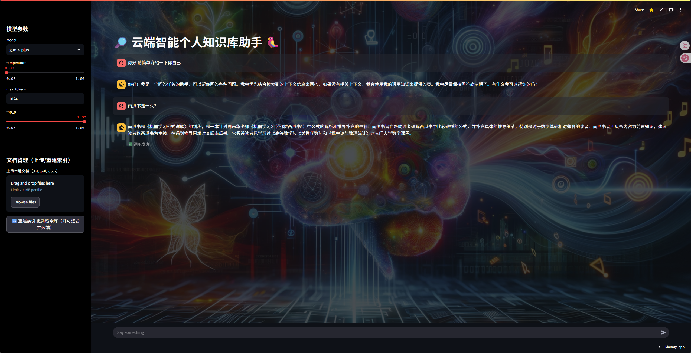

# 🚀 云端智能个人知识库助手

> 基于 RAG（Retrieval-Augmented
> Generation）架构构建的可扩展云端个人知识库系统\
> 支持文档动态更新、流式问答、多模型切换与云端部署

------------------------------------------------------------------------

## 📌 项目简介

本项目基于 [LLM Universe](https://github.com/datawhalechina/llm-universe) 二次开发，构建完整的 RAG 工作流：

-   🔍 基于 **LangChain + Embedding API** 构建高质量向量检索系统
-   🗄 使用 **Chroma 向量数据库** 实现可扩展存储
-   🧠 集成 GLM 系列大模型，支持流式输出
-   ⚡ 构建模块化 LCEL 问答链路
-   📄 支持文档上传 → 自动解析 → 向量增量构建 → 实时生效
-   ☁  基于 [Streamlit](https://share.streamlit.io/) 完成云端部署与交互界面设计


------------------------------------------------------------------------


## 🖥️ 界面展示
<div align="center">
  
  <p><em>图1：项目主界面预览</em></p>
</div>


------------------------------------------------------------------------

## 🚀 快速开始

### 1️⃣ 克隆项目

``` bash
git clone git@github.com:runn2020/LLM.git
```

### 2️⃣ 配置 Streamlit Secrets

在 `.streamlit/secrets.toml` 或 Streamlit Cloud 中填写：

``` toml
ZHIPUAI_API_KEY = "your_api_key"
GITHUB_TOKEN = "your_github_token"
GITHUB_REPO = "username/repo"
GITHUB_BRANCH = "main"
```

### 3️⃣ 云端运行

单击工作区中的New app按钮，然后指定存储库、分支和主文件路径，最后点击Deploy!按钮

------------------------------------------------------------------------

## 📦 部署说明（Streamlit Cloud）

1.  访问：https://share.streamlit.io/
2.  选择你的 GitHub 仓库
3.  设置 Python 版本为 **3.10**
4.  填写 Secrets
5.  部署完成 🎉

------------------------------------------------------------------------

## 🔄 索引重建机制

当出现：

> "索引目录中没有有效文档"

请检查：

-   文档是否正确上传到 `data_base/docs`
-   GitHub Token 是否有效
-   是否触发重建索引按钮

------------------------------------------------------------------------

## 📈 可扩展方向

-   🔁 接入 Milvus / FAISS 等向量数据库
-   📊 加入检索质量自动评估模块
-   🧪 引入 Bad Case 验证集优化 Prompt
-   🔐 增加权限控制与多用户支持

------------------------------------------------------------------------


------------------------------------------------------------------------

## 🙌 其他
如果有任何问题可以联系我 也欢迎大家多多提出 issue
 


